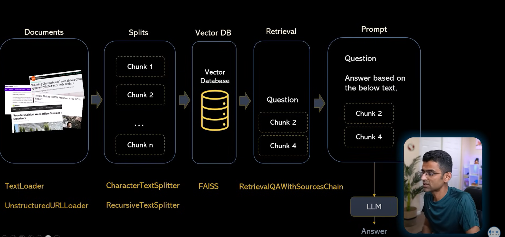

# 📰 News Research Tool 🔍
A Streamlit-based web app that helps you analyze news articles from URLs using LangChain, OpenAI, and FAISS. Enter up to 3 article links, ask your question, and get concise answers with sources! ⚡

## 🚀 Features
- 🔗 Input up to 3 news article URLs

- 🧠 Uses OpenAI LLMs to understand and answer questions

- 📑 Splits large text into manageable chunks

- 🧬 Generates embeddings using OpenAI Embeddings

- 🗃️ Stores and retrieves from a FAISS vector index

- ❓ Ask questions and get answers with source citations

## 📦 Tech Stack
- Streamlit – Interactive UI

- LangChain – LLM chaining and document handling

- OpenAI – LLMs and embeddings

- FAISS – Vector similarity search

- UnstructuredURLLoader – Loads data from web pages

## 🛠️ How It Works
### 1. Input URLs 🔗
Add up to 3 URLs in the sidebar

## 2. Process the URLs ⚙️

- Loads the article content

- Splits it into smaller chunks

- Embeds the chunks using OpenAI

- Stores them in a FAISS index

## 3. Ask Your Question ❓
Type in your question about the articles and get a smart, sourced answer!

## 🧪 Example
1. Enter links like:

```bash
https://example.com/news/article-1
https://example.com/news/article-2
```

2. Click Process

3. Type:

```bash
What is the main issue discussed in these articles?
```

4. Get an answer and view your sources! ✅

## 🧰 Installation & Run Locally
```bash
# Clone the repo
git clone https://github.com/your-username/news-research-tool.git
cd equity_news_research_tool

# Install dependencies
pip install -r requirements.txt

# Run the app
streamlit run main.py
```

## 📁 Project Structure
```
├── main.py # Main Streamlit application
├── faiss_index/ # FAISS vector store (created on run)
├── requirements.txt # Python dependencies
```

## 🔐 Environment Variables
Make sure you have an .env file with your OpenAI key:

```bash
env
OPENAI_API_KEY=your_openai_api_key
```

## 🌟 Future Improvements
1. ✅ Add URL validation

2. ✅ Cache FAISS index per session

3. 🧠 Add summarization and sentiment analysis

4. 🌍 Add support for more languages

## 🙌 Acknowledgements
Built with ❤️ using LangChain, OpenAI, Streamlit, and FAISS.

## 🧠 Architecture
